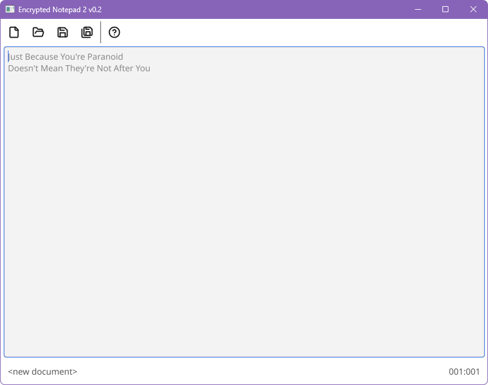

# Encrypted Notepad 2

This is a spiritual successor to the "Encrypted Notepad" app [previously developed on SourceForge](https://sourceforge.net/projects/enotes/), by the same author. The goal is still the same: *"Encrypted Notepad 2" does only one thing, but aims to do it perfectly - a Notepad-like simple text editor where files are saved (and later loaded) encrypted with industrial strength algorithms*. No ads, no network connection required, no bloat, just run it. If you know how to use the ancient Notepad app, you know how to use this app.



# Current status

Alpha version - major features are done (de/encryption is complete), but there's space for improvement, especially in UX.

# Experiment in sustainable Open Source

*Note from the author*

I am an Open Source veteran. I've put my code out there since before GitHub existed, and you can see my (early and embarrasing) work on SourceForge. All this time, I did it because I made something I want to share with the world, without expecting anything in return. But that isn't really sustainable. Software needs to be maintained. Bitrot is real. Operating systems get updated and move on, and the apps might not even run in a decade. That's what's happened with the original Encrypted Notepad.

Encrypted Notepad 2 is my experiment in combining Open Source with a business model. The source code in its entirety is on GitHub, but the binaries are not. If you want to build them yourself, you are welcome to. If Linux distro maintainers want to include it, they are also welcome to. But if you want to download binaries for Windows, OS X, Android, iOS, and even Linux - I'm going to charge for that. Not as a subscription, but as a one-time payment with a lifetime of upgrades.

# Downloading Encrypted Notepad 2

[Here is a link where you can buy binaries and priority support for Encrypted Notepad 2](https://payhip.com/b/q9s7S). By buying this product you support its future development, and get this in return:

* Windows, Linux, and Android versions of the software (OS X and iOS will be provided if there's enough interest)
* Lifetimes of updates for those binaries, for a single payment
* Priority support for any issues.

This is an open source app developed on GitHub. What you are buying here are the binaries and priority support. If you know how to, you can always build your own binaries from source.

# Building Encrypted Notepad 2

You will need Go 1.22+ installed. After cloning the repo, run:

```
go build
```

and run:

```
./EncryptedNotepad2
```

# Encryption

The files are encrypted using AES-256 and stored in the PGP/OpenPGP `.asc` format, that is interoperable with any other tool using the same standard. The OpenPGP and general crypto libraries used are:

* [ProtonMail's libraries](https://github.com/ProtonMail)
* [CloudFlare's circl](https://github.com/cloudflare/circl)
* [Golang's x/crypto](https://golang.org/x/crypto)

Feel free to inspect `go.mod` for details.

# F.A.Q.

## Why is the executable / package so big, compared to the old version?

Encrypted Notepad 2 is written in Go, and that means it's mostly statically compiled on all platforms. It uses the [Fyne](https://github.com/fyne-io/fyne) UI toolkit, and that means it uses almost no operating system-provided UI facilities on any platform. The flip side of that is that everything needs to be built-in into the single executable, making it bigger than expected for such a compact app.

The old version was written in Java, and that means it required a JRE to run. In that light, the new version is actually lighter-weight.

## Will you support other encryption algorithms?

No. Really, there's no need to. Either you trust AES, and in that case this is what you want, or you don't, in which case you most likely don't need this tool.

## Will you support more file formats (other than OpenPGP ASCII-armoured messages)?

Maybe - depends if there's a good use case and enough people want it.

## What is the actual cipher mode of AES-256 used in Encrypted Notepad 2?

When saving in OpenPGP's message format (the `.asc`) files, the mode is dictated by the OpenPGP spec. It is [OCFB-MDC](https://web.archive.org/web/20231230093732/https://articles.59.ca/doku.php?id=pgpfan:mdc). It is an AEAD mode, providing tamper protection as well as encryption.

## Why is the UI clunky / stange / not native?

It's because of Fyne... but it's getting better all the time.